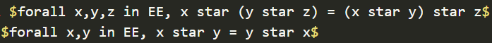
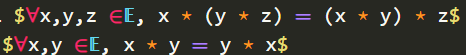

# Typst math VS Code Extension

A VS Code extension to simplify math writing in [Typst](https://typst.app/home).

# Installation

The extension can be downloaded from the [Visual Studio Marketplace](https://marketplace.visualstudio.com/items?itemName=surv.typst-math).

To preview math symbols, some fonts are required, which you can either install [manually](./assets/fonts/README.md) or let the extension install them automatically on first launch (works on Windows only).

Unfortunatly, you also need to set your theme colors in the extension settings, as the extension can't access theme colors directly. You can find the settings in `File > Preferences > Settings > Extensions > Typst Math`.
By default, the extension will use the monokai theme colors.

# Features

- Math snippets, commands and keywords to simplify math writing
- Math preview directly in the editor :
  - Render math symbols from : \
    
  - To : \
     \
    When you edit a line containing math symbols, these symbols will be displayed as text (as in the first image) for easy editing.

# Settings

- **Colors**: Select your theme colors.
- **RenderSymbolsOutsideMath**: If set to true, the extension will render symbols everywhere in the document, not only in math equations.
- **RenderSpaces**: If set to true, the extension will render space symbols like space, wj, space.quad...
- **HideUnnecessaryDelimiters**: If set to true, the extension will hide unnecessary delimiters in math equations, like paretheses in `x^(2 x)`
- **RenderingMode**: Choose whether to render only simple symbols or also complex equations.
- **RevealOffset**: The number of lines to reveal before and after the current line.
- **CustomSymbols**: You can add or override symbols with your own. The format is
```json
{
  "name": "mySymbol",
  "symbol": "|some chars|",
  "category": "operator"
}
```
`category` can be `keyword`, `operator`, `comparison`, `number`, `letter`, `bigletter`, `set`, `space` or `default`.

# Issues
If you encounter any issues, please report them on the [GitHub repository](https://github.com/supersurviveur/typst-math/issues).

Feel free to contribute to the project ! See the [CONTRIBUTING.md](./CONTRIBUTING.md) file for instructions on how to build the project.

# Acknowledgements
- Thanks to [Enter-tainer](https://github.com/Enter-tainer) for his advices
- Thanks to [Le-Foucheur](https://github.com/Le-Foucheur) for testing